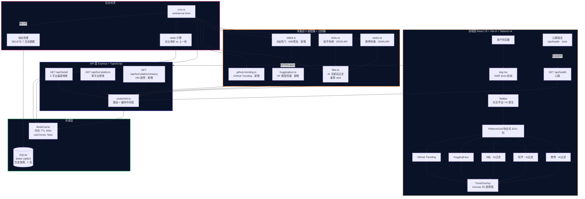
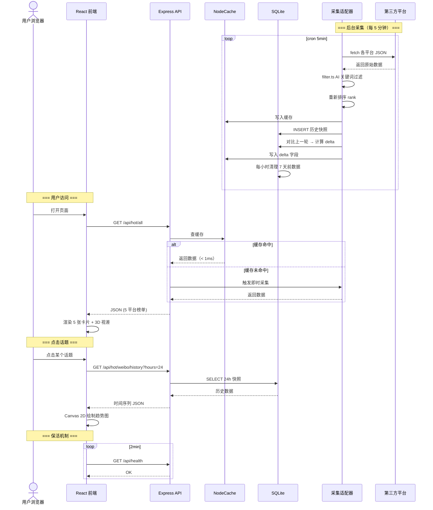
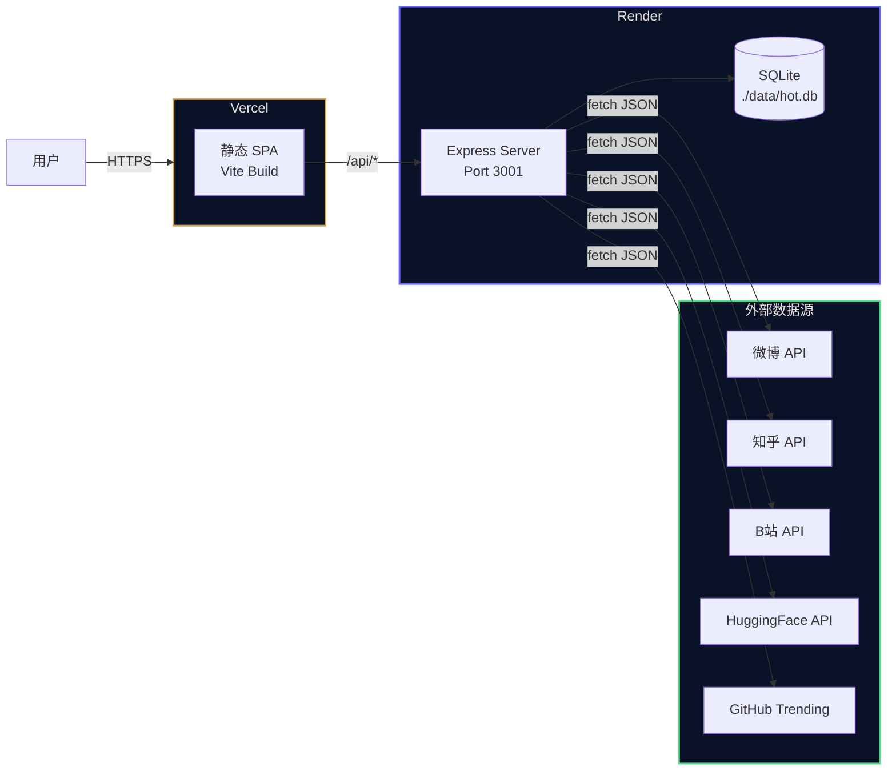

# AI 热搜 V2.0 · 系统架构图

```mermaid
graph TB
    subgraph FRONTEND[" 前端层 React 19 + Vite 8 + Tailwind v4 "]
        direction TB
        USER["用户浏览器"]
        APP["App.tsx<br/>SWR 3min 轮询"]
        TABS["TabBar<br/>社交平台 / AI 原生"]
        CARDS["PlatformGrid 响应式 3/2/1 列"]
        C1["微博 · AI过滤"]
        C2["知乎 · AI过滤"]
        C3["B站 · AI过滤"]
        C4["HuggingFace"]
        C5["GitHub Trending"]
        TREND["TrendOverlay<br/>Canvas 2D 趋势图"]
        HEART["心跳保活<br/>/api/health · 2min"]
        USER --> APP
        APP --> TABS --> CARDS
        CARDS --> C1 & C2 & C3 & C4 & C5
        C1 & C2 & C3 & C4 & C5 --> TREND
        HEART -.-> |"后台定时"| API2
    end

    subgraph API[" API 层 Express + TypeScript "]
        direction TB
        API1["GET /api/hot/all<br/>5 平台最新榜单"]
        API2["GET /api/health<br/>心跳"]
        API3["GET /api/hot/:platform<br/>单平台榜单"]
        API4["GET /api/hot/:platform/history<br/>24h 趋势 · 新增"]
        ROUTER["routes/hot.ts<br/>路由 + 缓存中间层"]
        API1 & API2 & API3 & API4 --> ROUTER
    end

    subgraph ADAPTER[" 采集层 5 适配器 + 过滤器 "]
        direction TB
        FILTER["filter.ts<br/>AI 关键词过滤<br/>重排 rank"]
        WBO["weibo.ts<br/>微博热搜 · JSON API"]
        ZHH["zhihu.ts<br/>知乎热榜 · JSON API"]
        BLI["bilibili.ts<br/>B站热门 · WBI签名 · 新增"]
        HUG["huggingface.ts<br/>HF 模型热搜 · 新增"]
        GH["github-trending.ts<br/>GitHub Trending · 新增"]
        WBO & ZHH & BLI --> FILTER
        FILTER --> ROUTER
        HUG & GH --> ROUTER
    end

    subgraph STORAGE[" 存储层 "]
        direction TB
        CACHE["NodeCache<br/>内存 TTL 300s<br/>useClones: false"]
        SQLITE[("SQLite<br/>better-sqlite3<br/>历史快照 · 7 天")]
        CACHE --> SQLITE
    end

    subgraph BG[" 后台任务 "]
        direction TB
        CRON["cron.ts<br/>setInterval 5min"]
        DELTA["delta 计算<br/>对比本轮 vs 上一轮"]
        CLEAN["自动清理<br/>DELETE 7 天前数据"]
        CRON --> WBO & ZHH & BLI & HUG & GH
        CRON --> CACHE
        CRON --> DELTA --> CACHE
        CRON -->|"每小时"| CLEAN --> SQLITE
    end

    ROUTER --> CACHE

    FRONTEND -->|"HTTPS fetch"| API

    style FRONTEND fill:#0a1228,stroke:#c9a96e,stroke-width:2px,color:#e8e4dd
    style API fill:#0a1228,stroke:#6366f1,stroke-width:2px,color:#e8e4dd
    style ADAPTER fill:#0a1228,stroke:#f97316,stroke-width:2px,color:#e8e4dd
    style STORAGE fill:#0a1228,stroke:#4ade80,stroke-width:2px,color:#e8e4dd
    style BG fill:#0a1228,stroke:#ec4899,stroke-width:2px,color:#e8e4dd
```

---

# 数据流时序图

```mermaid
sequenceDiagram
    actor U as 用户浏览器
    participant FE as React 前端
    participant API as Express API
    participant CACHE as NodeCache
    participant DB as SQLite
    participant AD as 采集适配器
    participant PF as 第三方平台

    Note over AD,PF: === 后台采集（每 5 分钟） ===
    loop cron 5min
        AD->>PF: fetch 各平台 JSON
        PF-->>AD: 返回原始数据
        AD->>AD: filter.ts AI 关键词过滤
        AD->>AD: 重新排序 rank
        AD->>CACHE: 写入缓存
        AD->>DB: INSERT 历史快照
        AD->>DB: 对比上一轮 → 计算 delta
        AD->>CACHE: 写入 delta 字段
        DB->>DB: 每小时清理 7 天前数据
    end

    Note over U,FE: === 用户访问 ===
    U->>FE: 打开页面
    FE->>API: GET /api/hot/all
    API->>CACHE: 查缓存
    alt 缓存命中
        CACHE-->>API: 返回数据（< 1ms）
    else 缓存未命中
        API->>AD: 触发即时采集
        AD-->>API: 返回数据
    end
    API-->>FE: JSON (5 平台榜单)
    FE->>FE: 渲染 5 张卡片 + 3D 视差

    Note over U,FE: === 点击话题 ===
    U->>FE: 点击某个话题
    FE->>API: GET /api/hot/weibo/history?hours=24
    API->>DB: SELECT 24h 快照
    DB-->>API: 历史数据
    API-->>FE: 时间序列 JSON
    FE->>FE: Canvas 2D 绘制趋势图

    Note over U,FE: === 保活机制 ===
    loop 2min
        FE->>API: GET /api/health
        API-->>FE: OK
    end
```

---

# 部署架构图

```mermaid
graph LR
    subgraph Vercel[" Vercel "]
        FE["静态 SPA<br/>Vite Build"]
    end
    subgraph Render[" Render "]
        BE["Express Server<br/>Port 3001"]
        DB[("SQLite<br/>./data/hot.db")]
        BE --> DB
    end
    subgraph External[" 外部数据源 "]
        W["微博 API"]
        Z["知乎 API"]
        B["B站 API"]
        H["HuggingFace API"]
        G["GitHub Trending"]
    end

    DNS["用户"]
    DNS -->|"HTTPS"| Vercel
    FE -->|"/api/*"| BE
    BE -->|"fetch JSON"| W & Z & B & H & G

    style Vercel fill:#0a1228,stroke:#c9a96e,stroke-width:2px,color:#e8e4dd
    style Render fill:#0a1228,stroke:#6366f1,stroke-width:2px,color:#e8e4dd
    style External fill:#0a1228,stroke:#4ade80,stroke-width:2px,color:#e8e4dd
```
